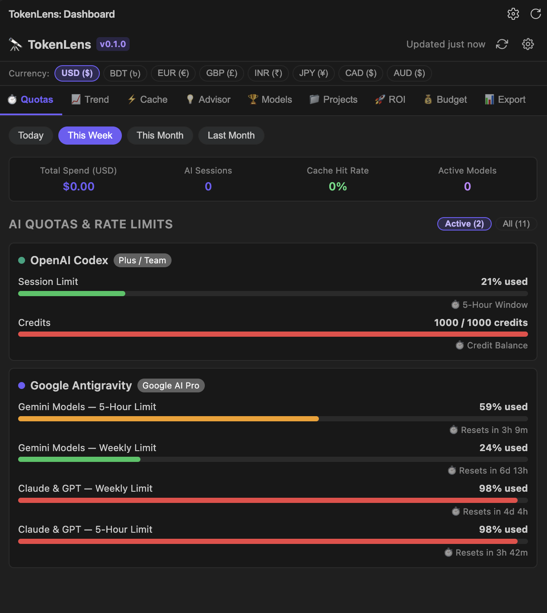
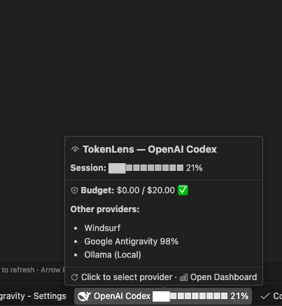

# 🔭 TokenLens Pro — All-in-One AI Usage, Quota & Cost Intelligence


> **"See the true cost, quota limits, and engineering impact of every AI model you use — in one place."**

[](https://marketplace.visualstudio.com/items?itemName=iamtashanto.tokenlens-pro)
[](#privacy)
[](#currency)
[](LICENSE)

---

## 📸 Screenshots & Live Previews

### 1. Interactive AI Quotas & Cost Intelligence Dashboard
Track your real-time spend, session count, prompt cache hit rate %, and multi-window quota meters across all active AI coding tools:



### 2. Multi-Window Quota Tracking & Live Reset Countdowns (Antigravity, Codex, Cursor)
Monitor your exact remaining quota pools for Gemini Models (Weekly & 5-Hour limits), Claude/GPT models, and reset countdowns in real-time:



---

## 🌟 Why TokenLens?

Developers today use multiple AI tools concurrently — **Google Antigravity**, **OpenAI Codex**, **Cursor**, **Claude Code**, **Windsurf**, **GitHub Copilot**, **Ollama**, and **DeepSeek**. Managing their rate limits, prompt caching, unexpected credit exhaustion, and costs has been painful and fragmented.

**TokenLens brings everything into one unified, ultra-fast, and private VS Code extension:**

- ⏱️ **Live Multi-Window Rate Limits & Quota Pools:** Weekly and 5-hour limit meters with exact countdown timers (`2h 15m`, `4d 12h`).
- ⚡ **Individual Provider Status Bar Indicators:** Displays dedicated compact circular gauges for every active AI tool simultaneously (e.g. `● AG 45%`, `● Codex 21%`, `● Copilot ✓`, `● Claude 18%`).
- 🔍 **In-Depth Hover Telemetry:** Hover over any provider's status bar item to view model-by-model quota meters, 5-hour and weekly reset countdowns, and budget tracking.
- 🌐 **Global Multi-Currency Conversion:** Instantly convert usage and spend into **USD ($), BDT (৳), EUR (€), INR (₹), GBP (£), JPY (¥), CAD, AUD**.
- 💡 **AI Cost Optimization Advisor:** Actionable suggestions to downscale routine tasks to mini models and save up to 65%.
- 🚀 **Prompt Cache Analyzer:** Real-time analysis of cached vs uncached tokens, hit rate %, and dollar savings.
- 📈 **Interactive Trend Analytics & Model Leaderboard:** Interactive cost charts and usage split by model, provider, and project workspace.
- 💰 **Smart Budget Guardrails:** Custom monthly budget alerts at 75%, 90%, 95% (Panic Mode), and 100%.
- 🔒 **100% Local & Zero Telemetry:** Credential decoding and database queries run entirely on your local machine.

---

## 🤖 Supported Providers (11 Providers)

| Provider | Mechanism & Strategies | Quotas & Windows Monitored |
| :--- | :--- | :--- |
| **Google Antigravity** | Language Server Port Scan (`lsof`), `GetQuotaSummary`, `GetUserStatus`, SQLite Protobuf decode (`state.vscdb`), Cloud Code API | Gemini Models (Weekly & 5h limits) + Claude/GPT Models with live reset countdowns |
| **OpenAI Codex** | Local session logs (`~/.codex/sessions/`), CLI auth token | Session quota %, token breakdown, lifetime spend |
| **Cursor** | SQLite DB (`state.vscdb`) token extraction, token refresh API, `DashboardService/GetCurrentPeriodUsage` | Included usage %, Auto requests %, Fast requests, Plan spend $, Billing cycle reset |
| **Windsurf** | SQLite `state.vscdb`, Dynamic listening port probe (`lsof`), `LanguageServerService/GetUserStatus` | Available Prompt Credits, Used Prompt Credits, Flex Credits |
| **Claude Code** | Credentials file (`~/.claude/credentials.json`), Session cookie, OAuth refresh | 5-Hour Session Window, 7-Day Weekly Window, Sonnet/Opus limits, Extra usage |
| **GitHub Copilot** | VS Code GitHub Authentication & Copilot quota endpoints | Premium request allowance, Chat suggestions, Monthly renewal date |
| **DeepSeek** | API Key balance endpoint (`api.deepseek.com/user/balance`) | Account balance in USD/CNY, Granted balance, Top-up balance |
| **Mistral** | Admin Cookie / API key (`console.mistral.ai/api/billing/usage`) | Usage credits, plan tiers |
| **Ollama (Local)** | Local daemon API (`localhost:11434/api/version`, `/api/tags`, `/api/ps`) | Server version, Installed model count, Running models, VRAM usage |
| **OpenRouter** | API key endpoint (`openrouter.ai/api/v1/auth/key`, `/api/v1/credits`) | Credit limit, Total USD usage, Rate limits (req/s) |
| **Groq** | API key balance & rate limit headers | Request quota, token rate limits |

---

## ⚡ Multi-Provider Sleek Status Bar

TokenLens gives each active provider its own **compact circular indicator** on your status bar:

```
● AG 45%   ● Codex 21%   ● Copilot ✓   ● Claude 18%
```

- **Independent Multi-Tool Display:** All active AI providers show side-by-side with crisp circular status indicators.
- **Provider-Specific Hover Tooltip:** Hovering over any item displays that exact provider's in-depth model limits, 5-hour and weekly reset timers, and budget status.
- **Instant Click Action:** Clicking any status bar item immediately opens and focuses the TokenLens dashboard.

---

## ⌨️ Keyboard Shortcuts & Commands

| Command | Shortcut | Description |
| :--- | :--- | :--- |
| `TokenLens: Refresh All Providers` | <kbd>R</kbd> *(inside dashboard)* | Re-queries all language servers, APIs, and local logs |
| `TokenLens: Open Dashboard` | — | Focuses and opens the TokenLens AI Dashboard |
| `TokenLens: Select Status Bar Provider` | — | Pin a specific provider or set to Auto (all active) |
| `TokenLens: Set Monthly Budget` | — | Configure your monthly spending budget in USD |
| `TokenLens: Set Hourly Rate for ROI` | — | Set your developer hourly rate for ROI savings math |
| `TokenLens: Detect Local Sources` | — | Auto-scans local directories for Claude, Codex, Grok, and Cline logs |
| `TokenLens: Export CSV / JSON` | — | Export full audit logs and usage summaries |

---

## ⚙️ Configuration Options

Customize TokenLens in VS Code Settings (`Cmd+,` or `Ctrl+,`):

```jsonc
{
  // Auto-refresh interval (e.g. 1m, 5m, 15m, 30m)
  "tokenlens.refreshInterval": "5m",

  // Monthly budget in USD for alert tracking
  "tokenlens.budget.monthly": 20,
  "tokenlens.budget.alertEnabled": true,

  // Preferred display currency (USD, BDT, EUR, GBP, INR, JPY, CAD, AUD)
  "tokenlens.display.currency": "USD",

  // Status bar display style: "compact" | "blocks" | "percent" | "minimal"
  "tokenlens.display.statusBarStyle": "compact",

  // Pin a specific provider to the status bar (leave empty for auto multi-provider)
  "tokenlens.display.statusBarProvider": "",

  // Hourly rate for ROI calculation ($)
  "tokenlens.roi.hourlyRate": 35,

  // Ollama local server URL
  "tokenlens.providers.ollama.url": "http://localhost:11434"
}
```

---

## 🔒 Privacy Guarantee

TokenLens is built from the ground up for security and privacy:
- ✅ **100% Local Processing:** Runs on your machine; no code, prompts, or proprietary data ever leaves your device.
- ✅ **Secure Secret Storage:** API keys and credentials are saved using VS Code's encrypted SecretStorage.
- ✅ **Zero Telemetry:** No third-party trackers, analytics, or external logging servers.

---

## 🛠️ Building & Packaging from Source

```bash
git clone https://github.com/iamtashanto/TokenLens.git
cd TokenLens
pnpm install
pnpm run compile
pnpm run build
pnpm test
pnpm run package:vsix
```

---

## 📄 License

Distributed under the **MIT License**. Created with ❤️ for AI engineers and developers worldwide.
